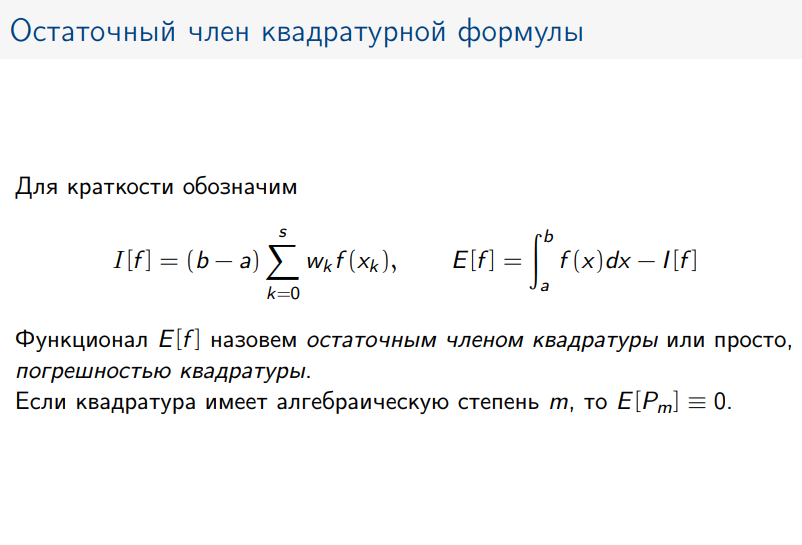
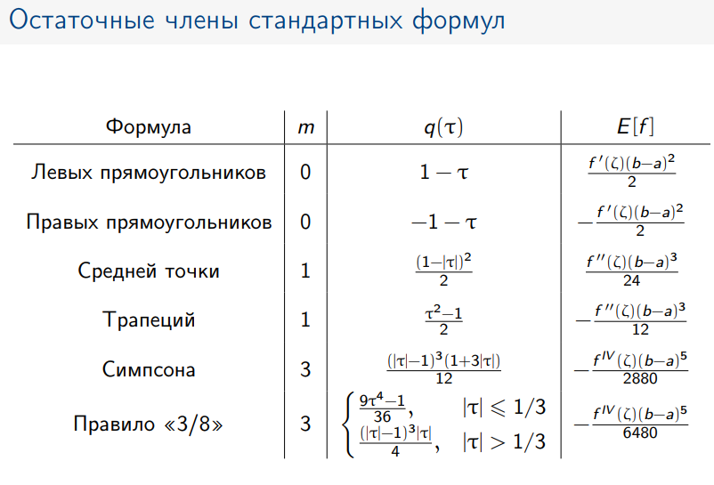

## 3 лабораторная «Интегрирование»

1) **Виды интегралов: определенный, неопределенный интеграл, несобственный интеграл:**  
   _Неопределенный интеграл_ - функция, являющееся первообразной для данной функции (т.е. чья производная равна иходной
   функции)  
   _Определенный интеграл_ - число, равное площади криволинейной трапеции под графиком функции  
   ! Определенный интеграл может называться _несобственным_, если удовлетворяет одному из условий:  
   1. хотя бы один из пределов равен бесконечности - площадь бесконечно длинной криволинейной трапеции
   2. функция является неограниченной в окрестности точек интегрирования - площадь бесконечно высокой криволинейной
      трапеции

2) **Точки разрыва первого и второго рода. Какие можно и нельзя устранять?**  
   Если в какой-то точке функции нарушется условие непрерывности, то такую точку называют точкой разрыва

   1. К точкам разрыва первого рода относят точки, где левый и правый пределы существуют и конечны

   - Точкой устранимого разрыва называется ситуация, когда левый и правый пределы равны друг другу, но не равны значению
     функции в этой точке (или она не определена)
   - Скачком называют ситуацию, когда левый и правый пределы не равны друг другу

   2. К точкам разрыва второго рода относят точки, где хотя бы один из односторонних пределов равен бесконечности или не
      определен

3) **Необходимые и достаточные условия существования интеграла**  
    - _Необходимые_:
        1. функция должна быть ограничена на итнервале (не равна бесконечности)
    - _Достаточные_:
        1. если функция непрерывная, то она интегрируема
        2. если функция ограничена на интервале И! имеет конечное число точек разрыва первого рода, то она интегрируема
        3. если фукнция монотонная, то она интегрируема (что вообщем-то соответствует пункту 2., с дополнительным
           требованием, чтобы функция всегда возрастала или убывала на интервале)

4) **Что такое предел?**  
   Пределы разделаются на _пределы последовательностей_ и _пределы функций_  
   _Предел функции_ - это значение, к которому стремится функции, при стремлении ее аргумента к какому-то числу

5) Расскажите про численный метод (методы прямоугольников, метод трапеций, метод Симпсона (парабол))

6) **Плюсы и минусы численного метода (метод прямоугольников):**  

7) **Правило Рунге**

8) **Что называется остаточным членом интегрирования, чему равна формула остаточного члена?**  
Остаточным членом называется разница между реальным значением интеграла и результатом работы численного метода

9) **Где применяются численные методы интегрирования?**  
В авиации при расчете скорости, ускорения; в инженерии при расчете объемов, площадей объектов (CAD, 3d); в 3Д моделировании; физических симуляциях

## Источники:
- [лекция МФТИ по численному интегрированию](https://mipt.ru/upload/medialibrary/235/integration.pdf)